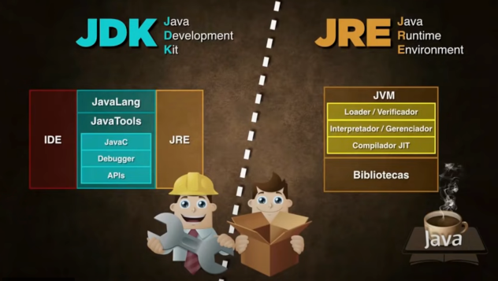

# Como Funciona o Java

## O que é Java?

Java é uma linguagem de programação de alto nível, orientada a objetos e multiplataforma. Isso significa que você pode escrever um programa Java uma vez e repeti-lo em diferentes sistemas operacionais, como Windows, macOS e Linux, sem precisar fazer alterações no código.

## Como o Java funciona?

O processo de execução de um programa Java envolve várias etapas, conforme ilustrado na imagem:

1. **Código Java**: Você escreve o código do seu programa em um arquivo com extensão .java. Este é o código fonte, legível por humanos.

2. **Compilador Java (javac)**: O compilador Java, chamado javac, traduz o código fonte .javaem um código intermediário chamado bytecode. O bytecode é um conjunto de instruções que uma Java Virtual Machine (JVM) pode entender. O arquivo de bytecode tem extensão .class.

3. **Java Virtual Machine (JVM)**: A JVM é o coração do Java. Ela é responsável por executar o bytecode. A JVM atua como uma camada de abstração entre o bytecode e o sistema operacional. Isso permite que o mesmo bytecode seja executado em diferentes sistemas operacionais, desde que haja uma JVM compatível instalada.

4. **Execução**: A JVM interpreta e executa o bytecode, transformando-o em instruções que o sistema operacional pode entender. O resultado é a execução do seu programa Java.

## Wora (Escreva uma vez, execute em qualquer lugar)

A capacidade de executar o mesmo bytecode em diferentes sistemas operacionais é conhecida como "Write Once, Run Anywhere" (Wora). Essa é uma das principais vantagens do Java, pois permite que os desenvolvedores criem aplicativos que podem ser executados em diversas plataformas sem a necessidade de reescrever o código.

### JDK e JRE

- **JDK (Java Development Kit)**: O JDK é um kit de desenvolvimento que inclui as ferramentas possíveis para criar e compilar programas Java. Ele contém o compilador `javac`, a JVM e outras bibliotecas e importadores.
- **JRE (Java Runtime Environment)**: O JRE é o ambiente de execução Java. Ele contém a JVM e as bibliotecas possíveis para executar programas Java. Se você só precisa executar programas Java, o JRE é suficiente. Se você precisa desenvolver programas Java, você precisa do JDK.

A imagem ilustra claramente a relação entre **JDK** e **JRE**. O **JDK** inclui o **JRE**, além de ferramentas de desenvolvimento como o compilador `javac` e o purificador. A **JVM**, que faz parte do **JRE**, é responsável por carregar, verificar e executar o bytecode.

### Em resumo:

1. Você escreve o código Java.
2. O compilador Java (javac) transforma o código em bytecode.
3. Uma **JVM** executa o bytecode, permitindo que o programa rode em qualquer sistema operacional com uma **JVM** compatível.
4. O **JDK** é o kit de desenvolvimento com o compilador, enquanto o **JRE** é o ambiente de execução com a **JVM**.

### [Voltar ao README Principal](../../README.md)
