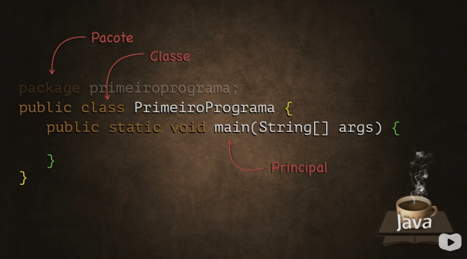

# Primeiro Programa



## `package`

Todo Programa em JAVA pode ser composto de pacotes `package`.

- Um pacote em Java é como uma pasta que organiza as classes. Ele serve para agrupar classes relacionadas e evitar conflitos de nomes.
- Pacotes facilitam a reutilização de código e a organização de projetos, tornando-os mais simples de manter e entender.

A nomeação do identificador `package` sedá com todas letras minúsculas `primeiroprograma`.

O `package` é opcional.

```
package primeiroprograma
```

## `class`

O primeiro comando obrigatório é o da classe.

Uma classe é como um modelo ou planta para criar objetos. Ela define os atributos (dados) e métodos (ações) que um objeto terá.

```
public class PrimeiroPrograma
```

## Método principal `main`

Dentro do bloco da classe vamos criar o método principal `main`.

```
public static void main(String[] args) { ... }
```

- O método "main" é o ponto de entrada de um programa Java. É onde a execução do código começa.

A nomeação da `class` se dá usando o **_camelCase_**, como todas as primeiras letras em maiúsculo.

### [Voltar ao README Principal](../../README.md)
